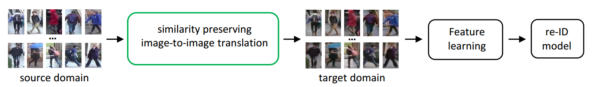
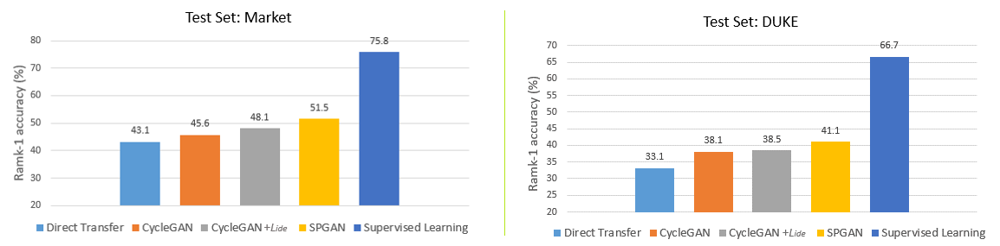

# Learning-via-Translation
Image-Image Domain Adaptation with Preserved Self-Similarity and Domain-Dissimilarity for Person Re-identification (https://arxiv.org/pdf/1711.07027.pdf) 

----------
## Framework Overview

Learning via translation for domain adaptation in person re-ID consists of two steps:

**1. Source-target image translation**

The first step is to translate the annotated dataset from source domain to target domain in an unsupervised manner.

For more reference, you can find our modified training code and generating code in ./SPGAN. We wrote a detailed README. If you still has some question, feel free to contact me (dengwj16@gmail.com).

**2. Feature learning**

With the translated dataset that contains labels, feature learning methods are applied to train re-ID models.

## Feature Learning
The code for re-ID feature learning is mainly modified from [IDE](https://github.com/zhunzhong07/IDE-baseline-Market-1501). 

### Train

 1. Train baselines:
```shell 
 cd $IDE_ROOT
  # train IDE on Market-1501
  ./experiments/market/train_IDE_ResNet_50_baseline.sh  
  # train IDE on DukeMTMC-reID
  ./experiments/duke/train_IDE_ResNet_50_baseline.sh
  # The IDE models for Market-1501 and DukeMTMC-reID are saved under: "out/market_train" and "out/duke_train", respectively
  # If you encounter this problem: bash: ./experiments/market/train_IDE_ResNet_50_baseline.sh: Permission denied
  # Please execute: chmod 777 -R experiments/
  ```
 2. Train IDE models trained on the translated images:
```shell 
 cd $IDE_ROOT
  # train IDE on Market-1501
  ./experiments/market/train_IDE_ResNet_50_domain.sh  
  # train IDE on DukeMTMC-reID
  ./experiments/duke/train_IDE_ResNet_50_domain.sh
  ```
### Feature Extraction
  ```Shell
  # 1. Market-1501:
  cd $IDE_ROOT/market_evaluation
  Run Matlab: extract_feature.m
  # The IDE features are saved under: "market_evaluation/feat"
  # 2. DukeMTMC-reID:
  cd $IDE_ROOT/duke_evaluation
  Run Matlab: extract_feature.m
  # The IDE features are saved under: "duke_evaluation/feat"
  ```
### Evaluation
  ```Shell
    Run Matlab: baseline_evaluation_IDE.m
  ```

### Trained Model

 - Baseline models
 
    IDE_Market and IDE_Duke: [Onedrive](https://1drv.ms/f/s!AuAnGqBokkOIgwHYqbEen3KTTV-j); [Baidu Yun](https://pan.baidu.com/s/1eUcqHwu)
 
 - IDE models trained on the translated images:
 
    IDE_Market2duke (SPGAN) and IDE_Duke2Market (SPGAN): 
	[Onedrive](https://1drv.ms/f/s!AuAnGqBokkOIgwCuf2OiqGn9Gmbm); [Baidu Yun](https://pan.baidu.com/s/1eTeItl4)


### Results


*(see more details in paper)*

### Contributing

If you have an implementation for a different framework, or an enhanced version of the current code, feel free to contribute to the repository. For any issues related to the code you can use the issue tracker from GitHub.

### References

[1] W. Deng, L. Zheng, Q. Ye, G. Kang, Y. Yang, and J. Jiao. Image-image domain adaptation with preserved self-similarity and domain-dissimilarity for person re-identification. arXiv preprint arXiv:1711.07027, 2017. 

[2] L. Zheng, Y. Yang, and A. G. Hauptmann. Person reidentification: Past, present and future. arXiv preprint
arXiv:1610.02984, 2016.
 ```
@inproceedings{image-image18,
  author    = {Weijian Deng and
               Liang Zheng and
               Qixiang Ye and
               Guoliang Kang and
               Yi Yang and
               Jianbin Jiao},
  title     = {Image-Image Domain Adaptation with Preserved Self-Similarity and Domain-Dissimilarity
               for Person Re-identification},
  booktitle = {CVPR},
  year      = {2018},
}
 ```
### License
The code is released under the MIT License. See the attached LICENSE file.

### Frequently Asked Questions
Q1: The direct transfer performance using pytorch is much lower than caffe.

Ans: We find the BN is the key factor to this gap, and see more in [here](https://github.com/Simon4Yan/Learning-via-Translation/issues/1).

Q2: Train IDE or IDE+ by using pytorch?

Ans: Yes, we recommend [Person_reID_baseline_pytorch](https://github.com/layumi/Person_reID_baseline_pytorch). Note that bn needed to be fixed (see Q1).

(We also give a simple code of IDE and IDE+ [here](https://github.com/Simon4Yan/Person_reID_baseline_pytorch), which is modifed from [Person_reID_baseline_pytorch](https://github.com/layumi/Person_reID_baseline_pytorch)).
