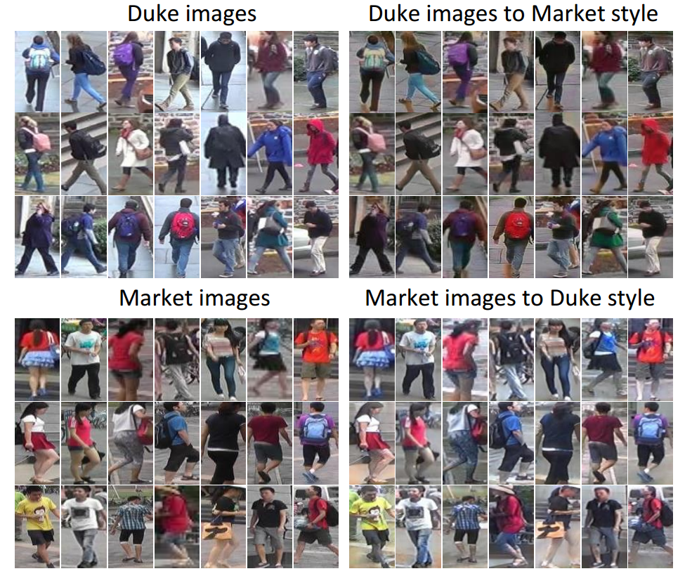
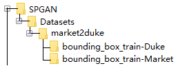

# SPGAN

----------


**Paper**: Image-Image Domain Adaptation with Preserved Self-Similarity and Domain-Dissimilarity for Person Re-identification (https://arxiv.org/pdf/1711.07027.pdf)

Tensorflow implementation of Similarity Preserving cycleconsistent Generative Adversarial Network ([SPGAN](https://arxiv.org/pdf/1711.07027.pdf)), mostly modified from https://github.com/LynnHo/CycleGAN-Tensorflow-PyTorch-Simple. Thank you for your kindly attention.

----------

## Visual examples of image-image translation


# Prerequisites
- tensorflow r1.0
- python 2.7

# Usage
```
cd SPGAN-master
```

## Download Datasets
- Download the Market-1501 dataset and DukeMTMC-reID:

> Market-1501:  http://liangzheng.com.cn/Project/project_reid.html 
> 
> DukeMTMC-reID: https://github.com/layumi/DukeMTMC-reID_evaluation

- Put the bounding_box_train of Duke and bounding_box_train of Market to ./Datasets/market2duke/ :

## Train Example
```bash
python train_spgan_demo.py --dataset=market2duke --gpu_id=0
```

## Test Example
```bash
python test_spgan.py --dataset=market2duke
``` 
- Translated images by SPGAN: [OneDrive](https://1drv.ms/u/s!AuAnGqBokkOIgnszfb2aPkH_hpPf); [Baidu Yun](https://pan.baidu.com/s/1c3P4Nug)


## Contributing

If you have an implementation for a different framework, or an enhanced version of the current code, feel free to contribute to the repository. For any issues related to the code, you can use the issue tracker from GitHub.

If you have any problem with the code of SPGAN, please contact us. And we will occasionally update this project.


## References

[1] W. Deng, L. Zheng, G. Kang, Y. Yang, Q. Ye, and J. Jiao. Image-image domain adaptation with preserved self-similarity and domain-dissimilarity for person re-identification. arXiv preprint arXiv:1711.07027, 2017. 

[2] J. Zhu, T. Park, P. Isola, and A. A. Efros. Unpaired image-to-image translation using cycle-consistent adversarial networks. ICCV, 2017.

[3] Scalable Person Re-identification: A Benchmark. Zheng, Liang and Shen, Liyue and Tian, Lu and Wang, Shengjin and Wang, Jingdong and Tian, Qi. In ICCV 2015.

[4] Z. Zheng, L. Zheng, and Y. Yang. Unlabeled samples generated by gan improve the person re-identification baseline in vitro. In ICCV, 2017.


## License

The code is released under the MIT License. See the attached LICENSE file.